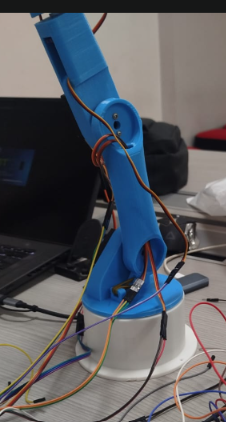

# Offline Voice-Controlled Robotic Arm

An embedded-AI robotic arm that recognizes spoken keywords locally on an ESP32-S3 and sends motion commands to an ATmega32A. The ATmega drives five servo joints through a PCA9685 PWM controller.



## Project status

This repository documents a working prototype, not a finished commercial product.

- Offline keyword inference runs on the ESP32-S3.
- UART communication links the ESP32-S3 and ATmega32A through a bidirectional logic-level converter.
- The ATmega32A controls the PCA9685 and moves one joint at a time.
- The physical build uses five servos: MG995 base, two MG996 joints, wrist-pitch SG90, and gripper SG90.
- The supplied voice model recognizes `down`, `go`, `on`, and `stop`. The safe firmware mapping currently uses `down`, `on`, and `stop`; `go` is intentionally ignored.
- The OLED is wired, but display rendering is not enabled until its controller is confirmed as SH1106 or SSD1306.
- Mechanical limits and servo calibration values must be verified for each physical arm before enabling unrestricted motion.

## System architecture

```text
INMP441 microphone ──I2S──> ESP32-S3
                               │
                         keyword inference
                               │ UART 9600 8N1
                               ▼
                    bidirectional level converter
                               │
                               ▼
                           ATmega32A
                               │ I2C
                               ▼
                            PCA9685
                               │ PWM signals only
                               ▼
                         five servo motors

External regulated 5 V supplies ──> servo power
All circuit grounds               ──> common ground
```

## Hardware

- ESP32-S3-N8R2 development board
- ATmega32A development board with an 8 MHz crystal
- INMP441 I2S microphone
- 1.3-inch I2C OLED
- PCA9685 16-channel PWM controller
- 4-channel bidirectional logic-level converter
- 1 × MG995 positional servo
- 2 × MG996 positional servos
- 2 × SG90 positional servos
- Mechanical limit switch
- USBasp programmer
- Separate regulated 5 V servo supplies

## Joint and channel map

| PCA9685 channel | Joint | Servo |
|---|---|---|
| CH0 | Base | MG995 |
| CH1 | Shoulder | MG996 |
| CH2 | Elbow | MG996 |
| CH3 | Wrist pitch | SG90 |
| CH4 | Disabled | Not connected |
| CH5 | Gripper | SG90 |

## Firmware

### ESP32-S3

The ESP32 firmware captures 16 kHz audio from the INMP441, calculates MFCC features, runs the included DS-CNN keyword model, and sends newline-terminated commands over UART.

The revised pin map is:

```text
INMP441 SCK -> GPIO5
INMP441 WS  -> GPIO6
INMP441 SD  -> GPIO7
OLED SDA    -> GPIO8
OLED SCL    -> GPIO9
UART TX     -> GPIO17
UART RX     -> GPIO18
```

The ESP32 sends a `PING` every 500 ms to keep the ATmega communication watchdog alive. The BOOT button sends `ARM`; voice input never arms the robot.

Build settings:

```text
Board: ESP32S3 Dev Module
Flash: 8 MB
PSRAM: QSPI PSRAM
Partition: 8M with SPIFFS
Arduino-ESP32: 3.3.12
```

The current ESP32 build uses approximately 650 KB of flash and 196 KB of static RAM.

### ATmega32A

The ATmega firmware provides:

- UART at 9600 8N1
- 100 kHz I2C control of the PCA9685
- gradual one-degree motion steps
- one moving joint at a time
- UART link watchdog
- active-low PCA9685 `OE` safety control
- disabled CH4 wrist-rotation output
- mechanical limit-switch input on PD2

It builds for an ATmega32A at 8 MHz. The verified build uses 6,132 bytes of flash and 867 bytes of SRAM.

The checked-in defaults remain safe: unrestricted arming and calibration require the builder to enter measured mechanical limits. Do not copy calibration values between different arms.

## Wiring

See [docs/WIRING.md](docs/WIRING.md) for the complete final wiring table, including the separated servo-power rails and common-ground arrangement.

## Repository structure

```text
firmware/
  kws_arm_esp32s3/ keyword spotting, MFCC, model weights and UART bridge
  atmega32a/      motion controller, PCA9685, UART and limit-switch drivers
docs/
  WIRING.md       complete final circuit connections
  LINKEDIN_POST.md
  VIDEO_OVERLAY.md
  images/
```

## Known limitations

- The present model weights do not contain trained `up` or `off` classes.
- The OLED controller has not been positively identified.
- A 5 V/3 A plus 5 V/2 A split supply can demonstrate sequential movement, but it is not a substitute for a properly rated single servo supply under simultaneous mechanical load.
- Mechanical homing direction and final servo limits are installation-specific.
- The current prototype is an educational build and is not intended for safety-critical operation.

## Next steps

- Retrain the keyword model with the full final command vocabulary.
- Confirm the OLED controller and add live status rendering.
- Measure and save per-joint mechanical limits.
- Replace the temporary split-power arrangement with a properly rated regulated supply and distribution harness.
- Add repeatable accuracy and latency measurements.

## License

Released under the [MIT License](LICENSE). Model weights are included as part of this prototype repository; confirm the original training-data license before redistributing a retrained model.

